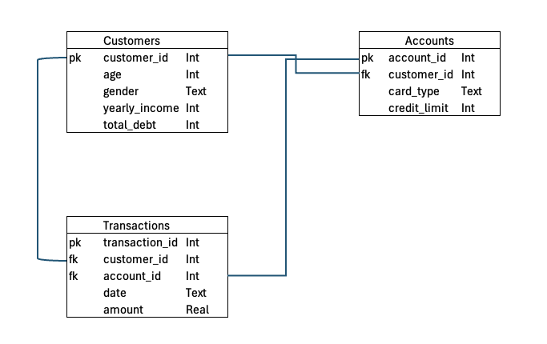

# Customer Debt Analytics Pipeline

## Project Description

This project demonstrates an **ELT-style analytics pipeline** built on financial transaction data. The primary focus is on **customer debt analysis**.

The goal of the project was to design a relational data model, transform raw data into analytical views using SQL, and create business-oriented debt insights through Power BI visualizations.

## Data Pipeline

1. Financial Transactions Dataset downloaded from [Kaggle](https://www.kaggle.com/datasets/computingvictor/transactions-fraud-datasets)

2. Relational data model designed in Excel

3. Tables created using Python in VS Code and data loaded into a SQLite database

4. SQL staging views created to clean and structure transaction and debt-related data

5. Final SQL views created to support customer debt analysis and reporting

6. Final analytical views exported as CSV files from SQLite

7. CSV files loaded into Power BI and a dashboard created to analyze customer debt and transaction patterns

### Example SQL: Customer Average Debt by Age Group

Below is an example of a SQL query used to create an analytical view based on staging data.

```sql
SELECT
    age_group,
    COUNT(DISTINCT customer_id) AS customer_count,
    ROUND(AVG(total_debt), 2) AS avg_total_debt
FROM stg_customer_age_groups
GROUP BY age_group
ORDER BY avg_total_debt DESC;
```

Full SQL scripts can be found in the [staging](staging/) and [views](views/) folders.

## Data Model

A relational data model was designed based on the financial transactions dataset downloaded from Kaggle. The data model is shown below:



Tables:

- `customers`
- `accounts`
- `transactions`

## Analytics & Dashboard

The Power BI dashboard focuses on customer debt insights, including:

- Average total debt per customer by card type
- Average transaction amount by card type
- Average total debt per customer by age group
- Average total debt per age group by card type

The Power BI dashboard is shown below:


## Technologies Used

- Python
- SQLite
- SQL
- Power BI
- VS Code
- Excel

## Key Learnings

- Designing relational data models for analytics
- Structuring SQL transformations using staging and final layers
- Applying ELT principles in an analytics project
- Creating business-focused debt insights from data
